# Laporan Praktikum Sistem Operasi — Modul 3

**Nama:** Muhamad Nasrulhaq  
**NRP:** 5027251117  
**Kelas:** SISOP B 
**Departemen:** Teknologi Informasi — FTEIC, ITS  

---

## Daftar Isi

- [Soal 1 — The Wired](#soal-1--the-wired)
  - [Penjelasan Poin Soal](#penjelasan-poin-soal-1)
  - [Edge Case & Error Handling](#edge-case--error-handling-soal-1)
  - [Penjelasan Kode](#penjelasan-kode-soal-1)
  - [Dokumentasi Screenshot](#dokumentasi-screenshot-soal-1)
- [Soal 2 — Battle of Eterion](#soal-2--battle-of-eterion)
  - [Penjelasan Poin Soal](#penjelasan-poin-soal-2)
  - [Edge Case & Error Handling](#edge-case--error-handling-soal-2)
  - [Penjelasan Kode](#penjelasan-kode-soal-2)
  - [Dokumentasi Screenshot](#dokumentasi-screenshot-soal-2)

---

## Soal 1 — The Wired

### Penjelasan Poin Soal 1

**Poin 1**
> *"Fase awal pembangunan memerlukan koneksi yang stabil untuk memastikan NAVI terdaftar di jaringan pusat. Hubungan ini harus memungkinkan NAVI terdaftar di jaringan melalui alamat dan port yang ditentukan di file protocol tanpa menghentikan stabilitas layanan bagi pengguna lain yang sudah terhubung."*

→ Koneksi antara client (`navi`) dan server (`server`) menggunakan alamat HOST dan PORT yang dibaca dari file `protocol`. Server menggunakan `SO_REUSEADDR` agar port langsung bisa dipakai kembali tanpa mengganggu koneksi client lain yang sudah aktif.

---

**Poin 2**
> *"Unit NAVI harus mampu menjalankan dua fungsi secara asinkron: mendengarkan transmisi dari The Wired dan mengirimkan input pengguna ke jaringan (tanpa fork)."*

→ Client menggunakan `pthread_create()` untuk menjalankan dua fungsi secara paralel tanpa `fork()`. Thread pertama (`thread_recv`) bertugas menerima pesan dari server, thread kedua (main thread) bertugas membaca input user dan mengirimkannya ke server.

---

**Poin 3**
> *"Server pusat The Wired dituntut untuk memiliki skalabilitas tinggi dan tidak terhambat oleh satu pengguna yang lambat. Server harus mampu mendeteksi aktivitas dari banyak klien, membedakan antara permintaan koneksi baru dengan pesan masuk, serta menangani diskoneksi klien secara bersih dengan command '/exit' ataupun interrupt signal."*

→ Server menggunakan `select()` pada event loop utama untuk memonitor banyak file descriptor sekaligus tanpa blocking. `FD_ISSET` dipakai untuk membedakan antara koneksi baru (server fd) dengan data masuk dari client yang sudah terhubung.

---

**Poin 4**
> *"Setiap entitas yang memasuki The Wired memerlukan identitas digital. NAVI wajib menginisialisasi identitas unik (nama) penggunanya dan memastikan tidak ada 2 atau lebih client dengan nama yang sama."*

→ Server menolak nama yang sudah dipakai client lain dan meminta client memilih nama lain. Client tidak diputus — hanya diminta input ulang sampai nama yang dipilih unik.

---

**Poin 5**
> *"Distribusi informasi di dalam The Wired harus bersifat kolektif dan menyeluruh. Implementasi mekanisme Broadcast dilakukan di sisi server, di mana setiap pesan yang diterima dari satu klien harus diteruskan ke seluruh klien lain yang sedang aktif."*

→ Server meneruskan setiap pesan yang diterima dari satu client ke semua client aktif lainnya, kecuali pengirimnya sendiri dan client admin.

---

**Poin 6**
> *"Selain ruang obrolan, The Wired harus menyediakan prosedur jarak jauh yang hanya bisa diakses oleh entitas pengelola (The Knights). Implementasikan pemanggilan fungsi jarak jauh yang memungkinkan NAVI khusus untuk meminta data internal server (jumlah NAVI aktif, durasi server berjalan, eksekusi prosedur mematikan server) tanpa melalui jalur broadcast obrolan (gunakan autentikasi password, password dibebaskan)."*

→ Admin "The Knights" diautentikasi dengan password. Setelah berhasil login, admin mendapat akses ke menu RPC khusus yang terpisah dari jalur broadcast — berisi perintah untuk melihat jumlah user aktif, uptime server, dan emergency shutdown.

---

**Poin 7**
> *"Setiap transmisi di dalam The Wired harus tercatat secara permanen untuk keperluan analisis oleh entitas dunia maya. Implementasikan mekanisme Logging dimana setiap pesan yang berhasil dibroadcast harus disimpan ke dalam sebuah file bernama history.log. Setiap baris log wajib mencantumkan stempel waktu dengan format [YYYY-MM-DD HH:MM:SS] [System/Admin/User] [Status/Command/Chat]."*

→ Setiap event (koneksi, pesan, disconnect, RPC admin) dicatat ke file `history.log` dengan format timestamp dan level yang ditentukan soal.

---

### Edge Case & Error Handling Soal 1

1. **File `protocol` tidak ditemukan** — `fopen()` gagal, `perror()` mencetak pesan error sistem, program keluar dengan `exit(1)`

2. **Server belum berjalan saat client connect** — `connect()` gagal, client menampilkan pesan error informatif lalu keluar

3. **Nama duplikat** — server menolak dan meminta client memilih nama lain tanpa memutus koneksi

4. **Password admin salah** — server langsung memutus koneksi client dengan pesan `Authentication Failed. Access Denied.`

5. **Client disconnect tiba-tiba** — `recv()` return 0 atau negatif, server memanggil `disconnect_client()` dan broadcast notifikasi ke semua client

6. **Server penuh (MAX\_CLIENTS = 64 tercapai)** — server menolak koneksi baru dengan pesan `Server penuh.` lalu menutup socket tersebut

7. **Pesan kosong dari client** — server mengabaikannya dan tidak melakukan broadcast

8. **Client ketik `/exit`** — server mendeteksi command, mengirim pesan disconnecting, memanggil `disconnect_client()`, dan broadcast notifikasi keluar

9. **Server di-Ctrl+C** — `SIGINT` ditangkap `handle_sigint()`, server broadcast pesan shutdown ke semua client, menutup semua socket, lalu keluar

10. **Buffer overflow partial message** — setiap client memiliki buffer parsial sendiri. Data yang datang terpotong disimpan di buffer dan baru diproses setelah `\n` diterima. Jika buffer penuh, data dipotong untuk mencegah overflow

---

### Penjelasan Kode Soal 1

#### Poin 1 — Koneksi via file `protocol`

**`server.c` — fungsi `load_protocol()`**
```c
static void load_protocol(void) {
    FILE *f = fopen("protocol", "r");
    if (!f) { perror("fopen protocol"); exit(1); }
    fscanf(f, "%63s\n%d\n%127[^\n]\n%127[^\n]",
           CFG_HOST, &CFG_PORT, CFG_ADMIN, CFG_PASS);
    fclose(f);
}
```
> `fopen()` membuka file `protocol` dalam mode read. `fscanf()` membaca baris per baris — `%63s` untuk HOST, `%d` untuk PORT, `%127[^\n]` untuk nama admin dan password yang bisa mengandung spasi. Nilai disimpan ke variabel global yang dipakai saat `bind()` dan autentikasi admin.

**`server.c` — inisialisasi socket dan bind**
```c
server_fd = socket(AF_INET, SOCK_STREAM, 0);
setsockopt(server_fd, SOL_SOCKET, SO_REUSEADDR, &opt, sizeof(opt));

struct sockaddr_in addr;
addr.sin_family      = AF_INET;
addr.sin_port        = htons(CFG_PORT);
addr.sin_addr.s_addr = INADDR_ANY;

bind(server_fd, (struct sockaddr *)&addr, sizeof(addr));
listen(server_fd, 10);
```
> Server membuat socket TCP, mengaktifkan `SO_REUSEADDR` agar port bisa dipakai kembali setelah restart tanpa menunggu timeout, lalu bind ke port yang dibaca dari file `protocol`.

**`navi.c` — client connect ke server**
```c
sock_fd = socket(AF_INET, SOCK_STREAM, 0);

struct sockaddr_in serv;
serv.sin_family = AF_INET;
serv.sin_port   = htons(CFG_PORT);
inet_pton(AF_INET, CFG_HOST, &serv.sin_addr);

connect(sock_fd, (struct sockaddr *)&serv, sizeof(serv));
```
> Client membuat socket dan connect ke HOST:PORT yang dibaca dari file `protocol` yang sama. `inet_pton()` mengkonversi string IP ke format binary yang dibutuhkan socket.

---

#### Poin 2 — Dua fungsi asinkron tanpa fork

**`navi.c` — membuat thread receiver**
```c
pthread_t tid;
if (pthread_create(&tid, NULL, thread_recv, NULL) != 0) {
    perror("pthread_create");
    exit(1);
}
```
> `pthread_create()` membuat thread baru yang menjalankan fungsi `thread_recv` secara paralel dengan main thread. Tidak menggunakan `fork()` sesuai requirement soal.

**`navi.c` — fungsi `thread_recv()`**
```c
static void *thread_recv(void *arg) {
    (void)arg;
    char buf[BUF_SIZE];
    char partial[BUF_SIZE * 2];
    int  partial_len = 0;

    while (!get_stop()) {
        int n = recv(sock_fd, buf, sizeof(buf) - 1, 0);
        if (n <= 0) {
            if (!get_stop())
                printf("\n[System] Connection to The Wired lost.\n");
            set_stop();
            break;
        }
        /* kumpulkan sampai ada newline lalu cetak */
        ...
    }
    return NULL;
}
```
> Thread ini terus `recv()` dari server. Jika server menutup koneksi (`n <= 0`), thread set flag `stop` lalu keluar. Menggunakan partial buffer untuk menangani pesan yang datang terpotong.

**`navi.c` — main thread kirim input dan join**
```c
char line[BUF_SIZE];
while (!get_stop()) {
    if (fgets(line, sizeof(line), stdin) == NULL) break;
    send(sock_fd, line, strlen(line), 0);
    line[strcspn(line, "\n")] = '\0';
    if (strcmp(line, "/exit") == 0) { set_stop(); break; }
}

pthread_join(tid, NULL);
```
> Main thread membaca input user dengan `fgets()` dan mengirimnya ke server. Setelah loop selesai, `pthread_join()` menunggu thread receiver selesai sebelum program keluar — konsep Join Thread dari README.

**`navi.c` — mutex untuk flag stop**
```c
static pthread_mutex_t stop_mutex = PTHREAD_MUTEX_INITIALIZER;

static void set_stop(void) {
    pthread_mutex_lock(&stop_mutex);
    stop = 1;
    pthread_mutex_unlock(&stop_mutex);
}

static int get_stop(void) {
    pthread_mutex_lock(&stop_mutex);
    int v = stop;
    pthread_mutex_unlock(&stop_mutex);
    return v;
}
```
> Flag `stop` diakses oleh dua thread sekaligus. Mutex dipakai untuk memastikan tidak terjadi race condition saat membaca atau menulis flag ini.

---

#### Poin 3 — Server multi-client dengan `select()`

**`server.c` — event loop dengan `select()`**
```c
while (1) {
    fd_set read_fds;
    FD_ZERO(&read_fds);
    FD_SET(server_fd, &read_fds);
    int max_fd = server_fd;

    for (int i = 0; i < MAX_CLIENTS; i++) {
        if (clients[i].fd != -1) {
            FD_SET(clients[i].fd, &read_fds);
            if (clients[i].fd > max_fd) max_fd = clients[i].fd;
        }
    }

    struct timeval tv = { .tv_sec = 1, .tv_usec = 0 };
    int activity = select(max_fd + 1, &read_fds, NULL, NULL, &tv);
    if (activity < 0) continue;

    if (FD_ISSET(server_fd, &read_fds)) {
        /* koneksi baru → accept() */
    }

    for (int i = 0; i < MAX_CLIENTS; i++) {
        if (FD_ISSET(clients[i].fd, &read_fds))
            client_recv(&clients[i]);
    }
}
```
> `FD_ZERO` + `FD_SET` mendaftarkan semua fd yang ingin dipantau. `select()` memblokir sampai ada aktivitas di salah satu fd. `FD_ISSET` membedakan apakah yang aktif adalah server fd (koneksi baru) atau client fd (pesan masuk/disconnect).

---

#### Poin 4 — Identitas unik

**`server.c` — fungsi `name_taken()`**
```c
static int name_taken(const char *name) {
    for (int i = 0; i < MAX_CLIENTS; i++)
        if (clients[i].fd != -1 &&
            clients[i].stage >= STAGE_CHAT &&
            strcmp(clients[i].name, name) == 0)
            return 1;
    return 0;
}
```
> Iterasi semua slot client yang aktif dan sudah melewati stage handshake (`STAGE_CHAT`). Jika ditemukan nama yang sama, return 1.

**`server.c` — penanganan nama duplikat di `handle_line()`**
```c
if (name_taken(line)) {
    char msg[NAME_SIZE + 80];
    snprintf(msg, sizeof(msg),
             "[System] The identity '%s' is already synchronized in The Wired.\n"
             "Enter your name: ", line);
    send_to(c->fd, msg);
    return;
}
```
> Jika nama sudah dipakai, server mengirim pesan penolakan dan langsung meminta nama baru. Client tidak diputus — stage tetap `STAGE_NAME`.

---

#### Poin 5 — Broadcast

**`server.c` — fungsi `broadcast()`**
```c
static void broadcast(const char *msg, int exclude_fd) {
    for (int i = 0; i < MAX_CLIENTS; i++) {
        Client *c = &clients[i];
        if (c->fd != -1 && !c->is_admin &&
            c->stage == STAGE_CHAT && c->fd != exclude_fd)
            send_to(c->fd, msg);
    }
}
```
> Loop semua client, skip admin, skip client yang tidak dalam stage chat, dan skip pengirim aslinya (`exclude_fd`). Pesan dikirim ke semua yang lolos filter.

---

#### Poin 6 — RPC Admin

**`server.c` — deteksi nama admin dan minta password**
```c
if (strcmp(c->name, CFG_ADMIN) == 0) {
    c->stage = STAGE_PASSWORD;
    send_to(c->fd, "Enter Password: ");
    return;
}
```

**`server.c` — verifikasi password**
```c
if (strcmp(line, CFG_PASS) == 0) {
    c->is_admin = 1;
    c->stage    = STAGE_ADMIN;
    send_to(c->fd, "\n[System] Authentication Successful. Granted Admin privileges.");
    send_admin_menu(c);
} else {
    send_to(c->fd, "[System] Authentication Failed. Access Denied.\n");
    disconnect_client(c);
}
```

**`server.c` — handle command admin (RPC)**
```c
if (strcmp(line, "1") == 0) {
    log_write("Admin", "RPC_GET_USERS");
    snprintf(reply, sizeof(reply),
             "[System] Active Entities: %d user(s) online.\n", active_users());
    send_to(c->fd, reply);
} else if (strcmp(line, "2") == 0) {
    log_write("Admin", "RPC_GET_UPTIME");
    long elapsed = (long)(time(NULL) - server_start);
    long h = elapsed/3600, m = (elapsed%3600)/60, s = elapsed%60;
    snprintf(reply, sizeof(reply),
             "[System] Server Uptime: %ldh %ldm %lds\n", h, m, s);
    send_to(c->fd, reply);
} else if (strcmp(line, "3") == 0) {
    log_write("Admin", "RPC_SHUTDOWN");
    emergency_shutdown();
}
```
> Admin command diproses di handler terpisah — tidak melewati `broadcast()` sama sekali sehingga tidak tercampur dengan pesan chat.

---

#### Poin 7 — Logging

**`server.c` — fungsi `log_write()`**
```c
static void log_write(const char *level, const char *msg) {
    time_t now = time(NULL);
    struct tm *t = localtime(&now);
    char ts[32];
    strftime(ts, sizeof(ts), "%Y-%m-%d %H:%M:%S", t);

    char line[BUF_SIZE + 128];
    snprintf(line, sizeof(line), "[%s] [%s] [%s]", ts, level, msg);
    printf("%s\n", line);

    FILE *f = fopen(LOG_FILE, "a");
    if (f) {
        fprintf(f, "%s\n", line);
        fclose(f);
    }
}
```
> `strftime()` memformat timestamp sesuai format yang diminta soal. File dibuka dengan mode `"a"` (append) agar log tidak tertimpa setiap kali dipanggil.

---

#### Edge Case — Penjelasan Kode

**EC 1 — File `protocol` tidak ditemukan**
```c
FILE *f = fopen("protocol", "r");
if (!f) { perror("fopen protocol"); exit(1); }
```
> Jika `fopen()` return `NULL`, `perror()` mencetak pesan error sistem lalu `exit(1)` menghentikan program.

**EC 2 — Server belum berjalan saat client connect**
```c
if (connect(sock_fd, (struct sockaddr *)&serv, sizeof(serv)) < 0) {
    fprintf(stderr, "[Error] Tidak bisa terhubung ke The Wired (%s:%d)\n",
            CFG_HOST, CFG_PORT);
    exit(1);
}
```
> `connect()` gagal jika server belum jalan, client langsung keluar dengan pesan informatif.

**EC 3 — Client disconnect tiba-tiba**
```c
int n = recv(c->fd, tmp, sizeof(tmp) - 1, 0);
if (n <= 0) { disconnect_client(c); return; }
```
> `recv()` return 0 berarti koneksi ditutup normal, negatif berarti error. Keduanya ditangani dengan `disconnect_client()` yang membersihkan slot dan broadcast notifikasi.

**EC 4 — Password admin salah**
```c
} else {
    send_to(c->fd, "[System] Authentication Failed. Access Denied.\n");
    disconnect_client(c);
}
```
> Jika password tidak cocok, server langsung memutus koneksi client tersebut.

**EC 5 — Buffer overflow partial message**
```c
int space = BUF_SIZE - c->buf_len - 1;
if (n > space) n = space;
memcpy(c->buf + c->buf_len, tmp, n);
```
> Sebelum menyalin data ke buffer, dihitung sisa ruang yang tersedia. Jika data lebih besar dari sisa ruang, data dipotong untuk mencegah buffer overflow.

**EC 6 — Server penuh**
```c
Client *slot = find_slot();
if (!slot) {
    send(new_fd, "[System] Server penuh.\n", 23, 0);
    close(new_fd);
}
```
> Jika `find_slot()` return `NULL` (semua 64 slot terpakai), koneksi baru langsung ditolak dan socket ditutup.

**EC 7 — Server di-Ctrl+C**
```c
static void handle_sigint(int sig) {
    (void)sig;
    log_write("System", "SERVER SHUTDOWN (SIGINT)");
    broadcast("[System] The Wired server is shutting down.\n", -1);
    for (int i = 0; i < MAX_CLIENTS; i++)
        if (clients[i].fd != -1) close(clients[i].fd);
    if (server_fd != -1) close(server_fd);
    exit(0);
}
```
> `SIGINT` ditangkap, server broadcast pesan shutdown, menutup semua socket secara bersih lalu keluar.

---

### Dokumentasi Screenshot Soal 1

#### Screenshot 1 — Nama Duplikat & Welcome Message

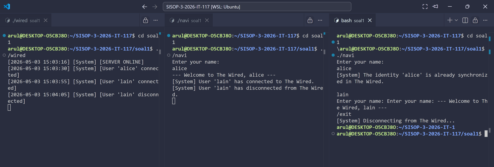

**Isi screenshot:**
- Client mencoba nama `alice` yang sudah dipakai → ditolak dengan pesan `[System] The identity 'alice' is already synchronized in The Wired.`
- Client mencoba nama `lain` → diterima, muncul `--- Welcome to The Wired, lain ---`
- Client mengetik `/exit` → muncul `[System] Disconnecting from The Wired...`

**Cara reproduce:**
```bash
# Terminal 1
./server

# Terminal 2 — client pertama
./navi
# Enter your name: alice

# Terminal 3 — client kedua coba nama sama
./navi
# Enter your name: alice   ← ditolak
# Enter your name: lain    ← diterima
# > /exit
```

---

#### Screenshot 2 — Chat Antar Dua Client

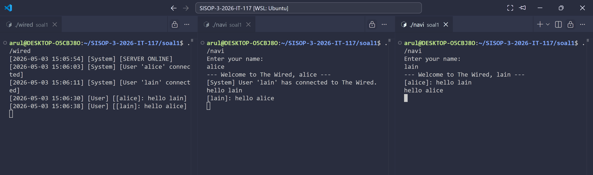

**Isi screenshot:**
- Sisi kiri (alice): mengirim `hello lain`, menerima balasan `[lain]: hello alice`
- Sisi kanan (lain): menerima `[alice]: hello lain`, membalas `hello alice`

**Cara reproduce:**
```bash
# Terminal 1
./server

# Terminal 2
./navi
# Enter your name: alice
# > hello lain

# Terminal 3
./navi
# Enter your name: lain
# > hello alice
```

---

#### Screenshot 3 — Admin Console (The Knights)

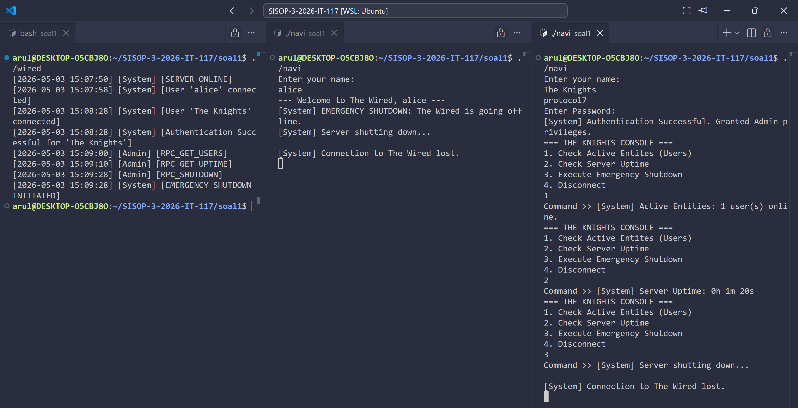

**Isi screenshot:**
- Login dengan nama `The Knights` dan password `protocol7`
- Muncul `[System] Authentication Successful. Granted Admin privileges.`
- Muncul menu RPC: Check Active Entities, Check Server Uptime, Execute Emergency Shutdown, Disconnect

**Cara reproduce:**
```bash
# Terminal 1
./server

# Terminal 2 (opsional — buat ada user aktif)
./navi
# Enter your name: alice

# Terminal 3 — admin
./navi
# Enter your name: The Knights
# Enter Password: protocol7
# Command >> 1   ← cek active users
# Command >> 2   ← cek uptime
# Command >> 3   ← emergency shutdown
```

---

#### Screenshot 4 — history.log

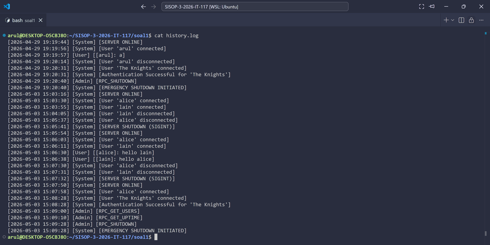

**Isi screenshot:**
- Isi file `history.log` dengan format `[YYYY-MM-DD HH:MM:SS] [Level] [Pesan]`
- Terlihat event: SERVER ONLINE, user connected, chat, disconnected, Admin RPC, EMERGENCY SHUTDOWN

**Cara reproduce:**
```bash
# Setelah menjalankan semua skenario di atas
cat history.log
```

---

## Soal 2 — Battle of Eterion

### Penjelasan Poin Soal 2

**Poin 1**
> *"arena.h akan menjadi tempat bagaimana pertempuran ini akan dimulai, semua strategi pertempuran, sistem pertempuran akan ada disini (definisi struct, config, shm key, dll). orion.c akan bertindak sebagai server dan eternal.c akan bertindak sebagai client."*

→ Seluruh definisi struct, konstanta, dan IPC key diletakkan di `arena.h` sebagai header bersama antara `orion.c` (server) dan `eternal.c` (client) sehingga tidak ada duplikasi definisi.

---

**Poin 2**
> *"HUBUNGAN ANTARA ORION DAN ETERNAL BERLAKU SECARA INTERNAL DAN BUKAN SECARA GLOBAL, OLEH KARENA ITU HUBUNGAN INI HANYA BERJALAN PADA IPC, dan bukan RPC."*

→ Komunikasi antara `orion` dan `eternal` menggunakan IPC System V — Shared Memory untuk berbagi data, Message Queue untuk request/response, dan Semaphore untuk mutual exclusion. Tidak menggunakan socket atau RPC.

---

**Poin 3**
> *"Ketika eternal dan orion terhubung, mereka kemudian akan mulai saling berkomunikasi dengan menggunakan Message Queue dan saling bertukar informasi menggunakan Shared Memory. Dan ketika orion tidak siap untuk menerima setiap komunikasi, maka eternal akan gagal untuk mencoba membuka alur pertempuran."*

→ Client mengecek ketersediaan server via `CMD_PING` sebelum melanjutkan. Jika server tidak merespons dalam 2 detik, client menampilkan pesan `"Orion are you there?"` dan keluar.

---

**Poin 4**
> *"sebelum memasuki pertempuran setiap prajurit harus memiliki identitas pada arena Battle Eterion, yaitu melakukan Register dan Login. username yang sudah didaftarkan tidak dapat didaftarkan lagi (unique). Semua data yang ada haruslah disimpan, dan harus persistent, sehingga ketika eternal mati, seluruh data masih dapat diakses dengan aman dan konsisten."*

→ Register memastikan username unik dengan mengecek di Shared Memory. Data player disimpan secara persistent ke file `players.dat`. Login memastikan tidak ada double login pada akun yang sama via flag `logged_in`.

---

**Poin 5**
> *"Semua prajurit akan memiliki nilai dan kekuatan yang sama, karena dalam dunia ini, semuanya akan memulai dari 0. XP: 0, Gold: 150, Lvl: 1."*

→ Setiap akun baru diinisialisasi dengan nilai default XP=0, Gold=150, Lvl=1, dan weapon=None saat register.

---

**Poin 6**
> *"Fase matchmaking akan berjalan selama 35 detik, jika dalam 35 detik tidak menemukan lawan, maka prajurit saat ini akan melawan monster (bot). Ketika prajurit sedang dalam area pertempuran, maka jika ada prajurit lain yang melakukan matchmaking, maka prajurit yang sedang dalam pertempuran tidak dapat terdeteksi."*

→ Matchmaking menunggu hingga 35 detik dengan polling SHM setiap detik. Jika timeout, player melawan bot "Wild Beast". Player yang sedang `in_battle=1` tidak akan terdeteksi oleh matchmaking player lain.

---

**Poin 7**
> *"sistem pertempuran akan menggunakan konsep realtime dan bukan turn-based, jadi setiap prajurit dapat saling serang tanpa harus menunggu satu dengan yang lainnya (asynchronous), untuk melakukan penyerangan prajurit dapat menekan tombol "a" pada keyboard. harus ada 5 log teratas dari keadaan pertempurannya, dan harus menampilkan secara realtime untuk health dari masing-masing prajurit. base damage: 10, base health: 100. Cooldown: 1 detik."*

→ Battle menggunakan render thread yang merefresh layar 10x/detik membaca HP dari SHM secara realtime. Tombol `a` mengirim `CMD_ATTACK` ke server dengan cooldown 1 detik.

---

**Poin 8**
> *"XP: Menang +50, Kalah +15 | Lvl: Bertambah ketika XP sudah mendapatkan nilai kelipatan 100, XP tidak terreset ke 0 | Gold: Menang +120, Kalah +30 | Damage: BASE DAMAGE + (total xp / 50) + (total bonus dmg weapon) | Health: BASE HEALTH + (total xp / 10)."*

→ Setelah battle selesai, server menghitung reward dan update stats player di SHM dan `players.dat`. Level naik setiap kelipatan 100 XP tanpa reset XP.

---

**Poin 9**
> *"prajurit akan otomatis menggunakan senjata dengan damage terbesar. Dan ketika seorang prajurit sudah memiliki senjata maka ia dapat mengeluarkan Ultimate pada saat pertempuran berlangsung. Ultimate: Total Damage * 3."*

→ Armory menampilkan 5 senjata dengan harga dan bonus damage. Server hanya menyetujui pembelian jika bonus damage senjata baru lebih besar dari yang dimiliki. Tombol `u` mengirim `CMD_ULTIMATE`, hanya aktif jika player memiliki senjata.

---

**Poin 10**
> *"sistem kali ini haruslah bisa menyimpan setiap history atau catatan dari pertempuran yang telah dilakukan oleh prajurit tersebut."*

→ Setiap battle yang selesai dicatat ke array `history` di struct `Player`, disimpan persistent ke `players.dat`, dan ditampilkan di menu History dengan kolom Time, Opponent, Result, dan XP gained.

---

**Additional Notes**
> *"Untuk semua proses pastikan tidak terjadi adanya Race Condition, gunakan Semaphore atau Mutex untuk mencegah hal tersebut."*

→ Semua akses ke Shared Memory di `orion.c` dibungkus dengan `sem_wait_op()` dan `sem_signal_op()` untuk memastikan hanya satu proses yang mengakses data pada satu waktu.

---

### Edge Case & Error Handling Soal 2

1. **Orion belum berjalan saat eternal dijalankan** — `shmget()` dan `msgget()` tanpa `IPC_CREAT` gagal jika server belum membuat IPC. Client menampilkan `"Orion are you there?"` dan keluar

2. **Orion jalan tapi tidak merespons ping** — `ping_server()` menggunakan `alarm(2)` sebagai timeout 2 detik. Jika tidak ada response, client menampilkan error dan keluar

3. **Username sudah terdaftar (Register)** — server mengecek nama di semua slot SHM sebelum membuat akun. Jika sudah ada, response error `"Username already taken!"` dikirim ke client

4. **Double login (akun sedang aktif)** — server mengecek flag `logged_in` di SHM. Jika sudah login di sesi lain, server menolak dengan `"Account already logged in!"`

5. **Username tidak ditemukan / password salah (Login)** — server mengembalikan response error spesifik `"Username not found!"` atau `"Wrong password!"`

6. **Server penuh (MAX\_PLAYERS = 32 tercapai)** — server menolak register baru dengan `"Server full!"`

7. **Gold tidak cukup beli senjata** — server mengecek `p->gold < WEAPONS[idx].price` sebelum proses pembelian. Jika tidak cukup, tolak dengan `"Not enough gold!"`

8. **Beli senjata lebih lemah dari yang dimiliki** — server mengecek bonus damage. Jika senjata baru lebih lemah, tolak dengan `"You already have a better weapon!"`

9. **Ultimate tanpa senjata** — client mengecek `weapon_idx >= 0` sebelum kirim `CMD_ULTIMATE`. Server juga mengecek hal yang sama

10. **Attack saat cooldown** — server mengecek `now - atk_cooldown[me] < ATTACK_COOLDOWN_MS`. Jika masih cooldown, serangan diabaikan

11. **Matchmaking timeout → bot** — jika 35 detik tidak ada lawan, client menginisialisasi battle slot dengan `player_slot[1] = -2` (kode bot) dan mereset semua state battle dari awal

12. **Player disconnect saat battle** — `handle_sigint()` di client memanggil `CMD_LOGOUT` yang mereset flag `logged_in` dan `in_battle` di server

13. **Race condition pada Shared Memory** — semua akses ke SHM di `orion.c` dibungkus `sem_wait_op()` dan `sem_signal_op()`

14. **Data tidak persistent setelah crash** — `save_players()` dipanggil setiap kali ada perubahan penting (register, logout, selesai battle, beli senjata)

15. **Battle slot tidak terbersihkan** — setelah `bs->done = 1`, thread monitor memanggil `finalize_battle()` yang mereset `bs->active = 0`

---

### Penjelasan Kode Soal 2

#### Poin 1 — arena.h sebagai header bersama

**`arena.h` — IPC keys dan konstanta**
```c
#define SHM_KEY        0x00001234
#define MSGQ_KEY       0x00005678
#define SEM_KEY        0x00009012

#define MAX_PLAYERS     32
#define BASE_DAMAGE     10
#define BASE_HEALTH     100
#define BASE_GOLD       150
```
> Semua key IPC dan konstanta game didefinisikan di satu tempat. Baik `orion.c` maupun `eternal.c` meng-include `arena.h` sehingga key yang dipakai selalu konsisten.

**`arena.h` — struct SharedArena (layout Shared Memory)**
```c
typedef struct {
    Player        players[MAX_PLAYERS];
    int           player_count;
    BattleSession battles[MAX_PLAYERS / 2];
    int           battle_count;
} SharedArena;
```
> Satu struct besar yang menjadi layout Shared Memory. Berisi semua data player dan semua sesi battle aktif.

**`arena.h` — helper inline untuk formula stats**
```c
static inline int player_damage(const Player *p) {
    int bonus = (p->weapon_idx >= 0) ? WEAPONS[p->weapon_idx].bonus_dmg : 0;
    return BASE_DAMAGE + (p->xp / 50) + bonus;
}

static inline int player_health(const Player *p) {
    return BASE_HEALTH + (p->xp / 10);
}

static inline int player_ultimate(const Player *p) {
    return player_damage(p) * 3;
}
```
> Formula dari soal diimplementasikan sebagai `static inline` di header agar bisa dipakai oleh kedua file tanpa duplikasi kode.

---

#### Poin 2 — IPC: Shared Memory, Message Queue, Semaphore

**`orion.c` — inisialisasi semua IPC (hanya server yang pakai `IPC_CREAT`)**
```c
shm_id = shmget(SHM_KEY, sizeof(SharedArena), IPC_CREAT | 0666);
arena  = (SharedArena *)shmat(shm_id, NULL, 0);
memset(arena, 0, sizeof(SharedArena));

msgq_id = msgget(MSGQ_KEY, IPC_CREAT | 0666);

sem_id = semget(SEM_KEY, 1, IPC_CREAT | 0666);
semctl(sem_id, 0, SETVAL, 1);  /* nilai awal 1 = unlocked */
```
> Server membuat ketiga IPC resource dengan `IPC_CREAT`. Client kemudian attach ke resource yang sudah ada tanpa `IPC_CREAT`.

**`eternal.c` — attach ke IPC yang sudah dibuat server**
```c
shm_id = shmget(SHM_KEY, sizeof(SharedArena), 0666);
if (shm_id < 0) {
    printf("Orion are you there?\n");
    exit(1);
}
arena = (SharedArena *)shmat(shm_id, NULL, 0);

msgq_id = msgget(MSGQ_KEY, 0666);
if (msgq_id < 0) {
    printf("Orion are you there?\n");
    exit(1);
}
```
> Client attach tanpa `IPC_CREAT`. Jika server belum membuat IPC, `shmget()` gagal dan client keluar dengan pesan error.

---

#### Poin 3 — Ping server sebelum lanjut

**`eternal.c` — fungsi `ping_server()`**
```c
static int ping_server(void) {
    send_msg(CMD_PING, NULL, NULL, 0);
    Response r;
    alarm(2);
    int ret = recv_resp(&r);
    alarm(0);
    return (ret == 0);
}
```
> Client kirim `CMD_PING` ke server dan tunggu response maksimal 2 detik via `alarm()`. Jika server tidak merespons, return 0 dan client keluar.

---

#### Poin 4 — Register, Login, Persistent

**`orion.c` — handle_register()**
```c
static void handle_register(Message *m) {
    sem_wait_op();
    if (find_player(m->arg1) >= 0) {
        sem_signal_op();
        send_resp(msgq_id, m->client_pid, -1, "Username already taken!", -1);
        return;
    }
    /* ... inisialisasi player baru ... */
    p->xp = BASE_XP; p->gold = BASE_GOLD; p->lvl = BASE_LVL;
    p->weapon_idx = -1;
    sem_signal_op();
    save_players();
    send_resp(msgq_id, m->client_pid, 0, "Account created!", slot);
}
```
> Semaphore dipakai saat cek dan tulis data player untuk mencegah race condition. `save_players()` dipanggil setelah setiap perubahan untuk menjaga persistensi.

**`orion.c` — handle_login() cek double login**
```c
if (p->logged_in) {
    sem_signal_op();
    send_resp(msgq_id, m->client_pid, -1, "Account already logged in!", -1);
    return;
}
p->logged_in  = 1;
p->client_pid = m->client_pid;
```
> Flag `logged_in` di SHM dipakai untuk mencegah satu akun dipakai dua client sekaligus.

**`orion.c` — save dan load persistent**
```c
static void save_players(void) {
    FILE *f = fopen(DATA_FILE, "wb");
    fwrite(&arena->player_count, sizeof(int), 1, f);
    for (int i = 0; i < MAX_PLAYERS; i++)
        if (arena->players[i].username[0] != '\0')
            fwrite(&arena->players[i], sizeof(Player), 1, f);
    fclose(f);
}
```
> Data ditulis dalam format binary ke `players.dat`. Saat server restart, `load_players()` membaca file ini dan memuat kembali semua data player ke SHM.

---

#### Poin 5 — Stats default

**`orion.c` — inisialisasi player baru**
```c
p->xp         = BASE_XP;    /* 0   */
p->gold       = BASE_GOLD;  /* 150 */
p->lvl        = BASE_LVL;   /* 1   */
p->weapon_idx = -1;         /* None */
```
> Nilai default sesuai soal diambil dari konstanta di `arena.h`.

---

#### Poin 6 — Matchmaking & Bot

**`eternal.c` — matchmaking loop 35 detik**
```c
long start = now_ms();
while (now_ms() - start < MATCHMAKING_TIMEOUT * 1000L) {
    BattleSession *bs = &arena->battles[bslot];
    if (bs->active && bs->player_slot[1] >= 0) {
        found = 1; break;
    }
    long elapsed = (now_ms() - start) / 1000;
    printf("\rSearching for an opponent... [%ld s]", elapsed);
    sleep(1);
}
```
> Client polling SHM setiap detik untuk cek apakah `player_slot[1]` sudah diisi lawan. Jika timeout, lanjut ke battle vs bot.

**`eternal.c` — inisialisasi battle vs bot**
```c
bs->player_slot[0]  = my_slot;
bs->player_slot[1]  = -2;   /* -2 = bot Wild Beast */
bs->hp[0]           = player_health(&arena->players[my_slot]);
bs->hp[1]           = 120;
bs->result[0]       = -1;
bs->result[1]       = -1;
/* reset cooldown, log, done */
arena->players[my_slot].in_battle = 1;
```
> `player_slot[1] = -2` adalah penanda bot. Semua state battle diinisialisasi penuh agar player bisa menyerang bot.

---

#### Poin 7 — Battle Realtime

**`eternal.c` — render thread**
```c
static void *render_thread(void *arg) {
    RenderArgs *ra = (RenderArgs *)arg;
    while (!battle_done) {
        render_arena(ra->bslot, ra->my_idx);
        usleep(100000); /* refresh 10x/detik */
    }
    return NULL;
}
```
> Thread render membaca HP dan combat log dari SHM setiap 100ms dan menampilkan ke layar secara realtime.

**`eternal.c` — input loop battle (nonblocking)**
```c
enable_raw_mode();
while (!battle_done) {
    char c = 0;
    read(STDIN_FILENO, &c, 1);
    long now = now_ms();

    if (c == 'a' || c == 'A') {
        if (now - last_atk >= ATTACK_COOLDOWN_MS) {
            send_msg(CMD_ATTACK, NULL, NULL, bslot);
            last_atk = now;
        }
    } else if (c == 'u' || c == 'U') {
        if (arena->players[my_slot].weapon_idx >= 0 &&
            now - last_ult >= ATTACK_COOLDOWN_MS) {
            send_msg(CMD_ULTIMATE, NULL, NULL, bslot);
            last_ult = now;
        }
    }
}
```
> Terminal diset ke raw mode agar input langsung terbaca tanpa tekan Enter. Cooldown dicek di sisi client sebelum kirim request ke server.

**`orion.c` — handle_attack() di server**
```c
long now = now_ms();
if (now - *cd < ATTACK_COOLDOWN_MS) { sem_signal_op(); return; }
*cd = now;

int dmg = is_ult ? player_ultimate(attacker) : player_damage(attacker);
bs->hp[opp] -= dmg;

if (bs->hp[opp] <= 0) {
    bs->result[me]  = 1;
    bs->result[opp] = 0;
    bs->done = 1;
}
```
> Server juga mengecek cooldown untuk validasi ganda. Damage dihitung dengan formula dari `arena.h` dan langsung ditulis ke SHM.

---

#### Poin 8 — XP, Gold, Level setelah battle

**`orion.c` — finalize_battle()**
```c
int xp_gain   = win ? 50 : 15;
int gold_gain = win ? 120 : 30;

p->xp   += xp_gain;
p->gold += gold_gain;
p->lvl   = 1 + (p->xp / 100);  /* level naik tiap kelipatan 100 XP */
```
> XP tidak direset — level dihitung langsung dari total XP kumulatif dengan rumus `1 + (xp / 100)`.

---

#### Poin 9 — Armory & Ultimate

**`orion.c` — handle_buy_weapon()**
```c
if (p->weapon_idx < 0 || WEAPONS[idx].bonus_dmg > WEAPONS[p->weapon_idx].bonus_dmg) {
    p->gold -= WEAPONS[idx].price;
    p->weapon_idx = idx;
    save_players();
} else {
    send_resp(..., "You already have a better weapon!", -1);
}
```
> Server hanya mengizinkan pembelian jika senjata baru memiliki bonus damage lebih besar — otomatis pakai yang terkuat.

---

#### Poin 10 — Match History

**`orion.c` — simpan history setelah battle**
```c
HistoryEntry *h = &p->history[p->history_count++];
strncpy(h->time_str, ts, sizeof(h->time_str) - 1);
strncpy(h->opponent, arena->players[opp_slot].username, NAME_LEN - 1);
h->result    = win;
h->xp_gained = xp_gain;
```

**`eternal.c` — tampilkan history**
```c
for (int i = count - 1; i >= 0 && i >= count - 10; i--) {
    HistoryEntry *h = &p->history[i];
    printf("│ %-8s │ %-12s │ %s%-4s%s │ +%-4d │\n",
           h->time_str, h->opponent,
           h->result ? GREEN : RED,
           h->result ? "WIN" : "LOSS",
           RESET, h->xp_gained);
}
```
> History ditampilkan dari yang terbaru (reverse order) dengan maksimal 10 entri terakhir.

---

#### Edge Case — Penjelasan Kode

**EC 1 — Orion belum berjalan**
```c
shm_id = shmget(SHM_KEY, sizeof(SharedArena), 0666);
if (shm_id < 0) {
    printf("Orion are you there?\n");
    exit(1);
}
```
> Tanpa `IPC_CREAT`, jika SHM belum dibuat server maka `shmget()` langsung gagal.

**EC 2 — Race condition SHM**
```c
static void sem_wait_op(void) {
    struct sembuf op = { 0, -1, 0 };
    semop(sem_id, &op, 1);
}
static void sem_signal_op(void) {
    struct sembuf op = { 0, +1, 0 };
    semop(sem_id, &op, 1);
}
```
> Semua fungsi handler di server membungkus akses SHM dengan `sem_wait_op()` dan `sem_signal_op()`. Nilai semaphore awal 1 (binary mutex).

**EC 3 — Gold tidak cukup**
```c
if (p->gold < WEAPONS[idx].price) {
    sem_signal_op();
    send_resp(msgq_id, m->client_pid, -1, "Not enough gold!", -1);
    return;
}
```

**EC 4 — Ultimate tanpa senjata**
```c
if (arena->players[my_slot].weapon_idx >= 0 &&
    now - last_ult >= ATTACK_COOLDOWN_MS) {
    send_msg(CMD_ULTIMATE, NULL, NULL, bslot);
}
```
> Cek weapon di sisi client sebelum kirim request, server juga validasi ulang.

**EC 5 — Data persistent saat crash**
```c
static void handle_sigint(int sig) {
    (void)sig;
    save_players();   /* simpan dulu sebelum exit */
    cleanup();
    exit(0);
}
```
> `save_players()` dipanggil di `SIGINT` handler agar data tidak hilang saat server dimatikan normal.

---

### Dokumentasi Screenshot Soal 2

#### Screenshot 1 — Orion are you there?

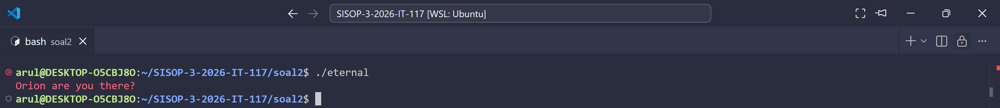

**Isi screenshot:**
- Client dijalankan sebelum server → muncul pesan `"Orion are you there?"` dan program keluar

**Cara reproduce:**
```bash
# Pastikan orion TIDAK berjalan
./eternal
# Output: Orion are you there?
```

---

#### Screenshot 2 — Register & Login

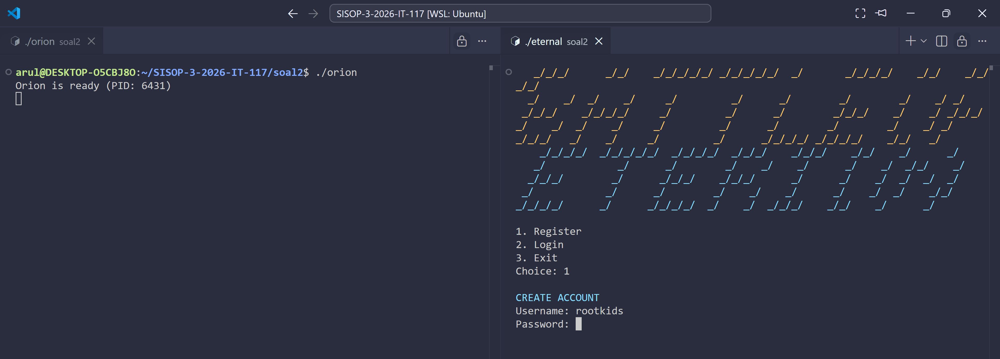
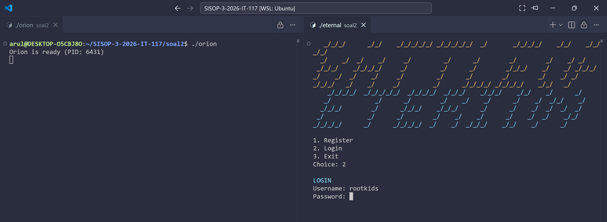


**Isi screenshot:**
- Pilih menu `1. Register` → input username dan password → muncul `Account created!`
- Pilih menu `2. Login` → input credentials → masuk ke `lobby`

**Cara reproduce:**
```bash
# Terminal 1
./orion

# Terminal 2
./eternal
# Choice: 1
# Username: rootkids
# Password: 12321
# Account created!
# Choice: 2
# Username: rootkids
# Password: 12321
```

---

#### Screenshot 3 — Main Menu & Profile

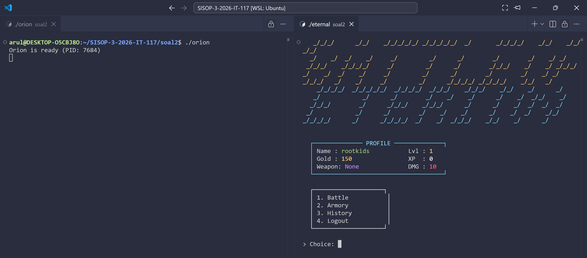

**Isi screenshot:**
- Setelah login, tampil banner, profil player (Name, Gold, Lvl, XP), dan menu: Battle, Armory, History, Logout

**Cara reproduce:**
```bash
# Setelah login berhasil → langsung tampil main menu
```

---

#### Screenshot 4 — Matchmaking & Battle

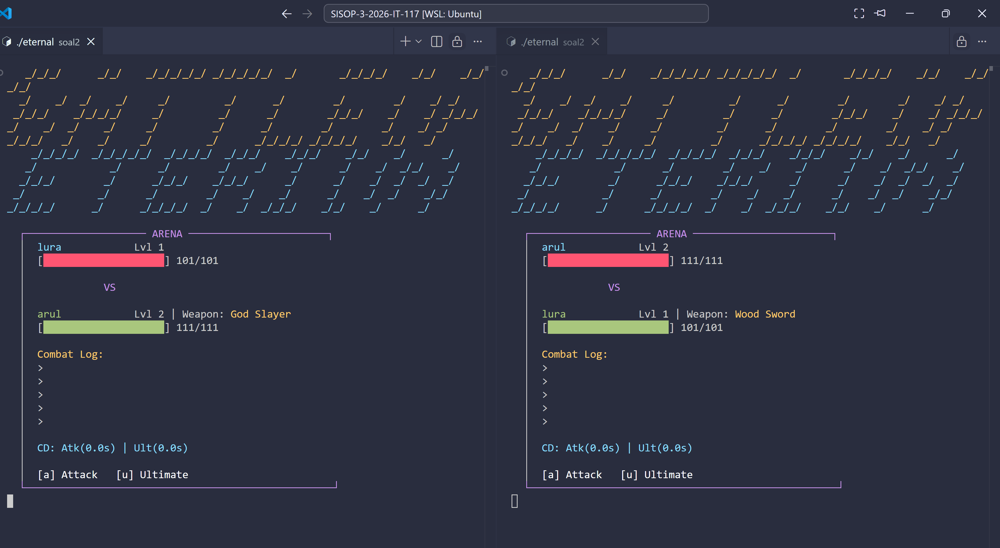
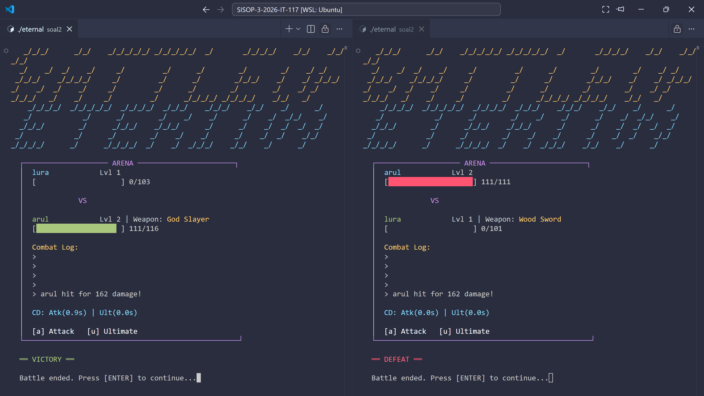

**Isi screenshot:**
- Sisi kiri dan kanan: dua client dalam fase matchmaking `"Searching for an opponent... [X s]"`
- Setelah match ditemukan: tampilan ARENA dengan HP bar, combat log, cooldown indicator
- Setelah battle selesai: muncul `VICTORY` atau `DEFEAT`

**Cara reproduce:**
```bash
# Terminal 1
./orion

# Terminal 2
./eternal
# Login → Choice: 1 (Battle)
# Tekan 'a' untuk attack, 'u' untuk ultimate

# Terminal 3
./eternal
# Login dengan akun lain → Choice: 1 (Battle)
```

---

#### Screenshot 5 — Armory

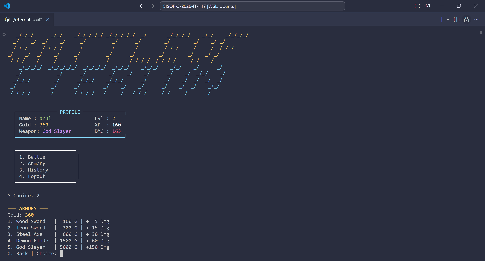

**Isi screenshot:**
- Tampilan menu armory dengan daftar 5 senjata, harga, dan bonus damage
- Gold player ditampilkan di atas

**Cara reproduce:**
```bash
# Setelah login → Choice: 2 (Armory)
# Pilih nomor senjata yang ingin dibeli
```

---

#### Screenshot 6 — Match History

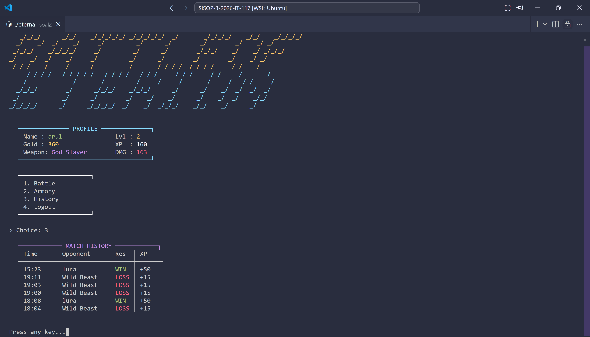

**Isi screenshot:**
- Tabel match history dengan kolom Time, Opponent, Result (WIN/LOSS), XP gained
- Hasil terbaru ditampilkan paling atas

**Cara reproduce:**
```bash
# Setelah beberapa battle → Choice: 3 (History)
```
